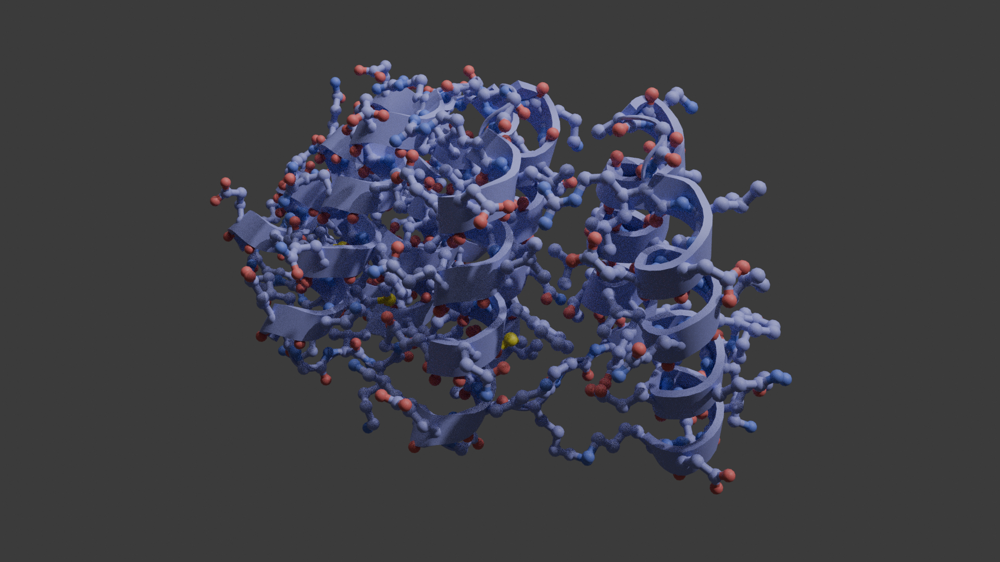

# Blender (Molecular Nodes add-on) チュートリアル

このチュートリアルを独習したい場合は、[2024年度のセミナー動画(研究室内限定の公開)](https://suitc-my.sharepoint.com/:v:/r/personal/ymatsunaga_mail_saitama-u_ac_jp/Documents/lab/%E5%8B%95%E7%94%BB/20240717_blender.mp4?csf=1&web=1&nav=eyJyZWZlcnJhbEluZm8iOnsicmVmZXJyYWxBcHAiOiJPbmVEcml2ZUZvckJ1c2luZXNzIiwicmVmZXJyYWxBcHBQbGF0Zm9ybSI6IldlYiIsInJlZmVycmFsTW9kZSI6InZpZXciLCJyZWZlcnJhbFZpZXciOiJNeUZpbGVzTGlua0NvcHkifX0&e=aKu0lk)を視聴して学習してください。

## 目次
1. [はじめに](#はじめに)
2. [Blenderのインストールと Molecular Nodes アドオンの設定](#Blenderのインストールと-Molecular-Nodes-アドオンの設定)
3. [Blenderの起動と Molecular Nodes の有効化](#Blenderの起動と-Molecular-Nodes-の有効化)
4. [分子の読み込み](#分子の読み込み)
5. [表示スタイルの変更](#表示スタイルの変更)
6. [ライトとカメラの設定](#ライトとカメラの設定)
7. [マテリアルの編集](#マテリアルの編集)
8. [アニメーションの作成](#アニメーションの作成)
9. [レンダリングと出力](#レンダリングと出力)
10. [終わりに](#終わりに)

## はじめに

Blenderは、オープンソースの3DCG制作ソフトウェアとして広く知られているが、Molecular Nodesアドオンを使用することで、分子構造の可視化ツールとしても強力な機能を発揮する。このアドオンは、Brady Johnston氏によって開発されている。従来の分子可視化ソフトウェアとは異なり、Blenderの高度な3DCG機能を活用することで、写実的なレンダリングや複雑なアニメーションの作成が可能になっている。Blenderのノードベースのワークフローを使う。通常のBlenderの可視化と同じように、直感的な操作で(？)複雑な分子構造を表現し、高品質な画像やアニメーションを生成できる(はず)。

このチュートリアルでは、Molecular Nodesアドオンの基本的な使い方を学び、Blenderを用いた分子構造の可視化の基礎を習得することを目指す。

基本的には[ドキュメント](https://bradyajohnston.github.io/MolecularNodes/)に沿って進めていく。

## Blenderのインストールと Molecular Nodes アドオンの設定

1. Blenderの公式ウェブサイト( https://www.blender.org/ )にアクセスし、最新版をダウンロードする。
2. ダウンロードしたインストーラを実行し、画面の指示に従ってBlenderをインストールする。
3. Molecular Nodesアドオンの公式GitHubページ( https://github.com/BradyAJohnston/MolecularNodes )にアクセスする。
4. 「Releases」ボタンをクリックし、「Download ZIP」を選択してアドオンをダウンロードする。その際に Blender と同じバージョン番号のものをインストールする。
5. ダウンロードしたZIPファイルを解凍せずに保存しておく。(BlenderではZIPのままアドオンインストールするため)

## Blenderの起動と Molecular Nodes の有効化

1. Blenderを起動する。
2. 「Edit」→「Preferences」を選択する。
3. 「Add-ons」タブを選択し、右上の「Install」ボタンをクリックする。
4. 先ほどダウンロードしたMolecular NodesのZIPファイルを選択し、「Install Add-on」をクリックする。
5. インストールが完了したら、検索欄に「Molecular」と入力し、「Molecular Nodes」アドオンのチェックボックスをオンにして有効化する。
6. Preferencesウィンドウを閉じる。

## 分子の読み込み

1. Blenderのメインウィンドウで、「Add」→「Molecular Nodes」→「Import PDB」を選択する。
2. ファイルブラウザが開くので、読み込みたいPDBファイルを選択し、「Import PDB」をクリックする。
3. 分子構造がシーンに読み込まれ、自動的に基本的な表示スタイルが適用される。

## 表示スタイルの変更

1. 読み込んだ分子オブジェクトを選択する。
2. 右側のプロパティパネルで「Molecular Nodes」タブを探す。
3. 「Style」ドロップダウンメニューから、希望する表示スタイル（例：Ball and Stick、Spacefill、Ribbonなど）を選択する。
4. 各スタイルに応じて表示される追加オプションを調整して、見た目をカスタマイズする。

## ライトとカメラの設定

https://youtu.be/S6aAvxUx2ko?si=_YDhf4kOHr50_We_&t=2980 を参考にする

## マテリアルの編集

1. 分子オブジェクトを選択し、プロパティパネルの「Material」タブを開く。
2. 「Shader Editor」ウィンドウを開き、ノードを編集してマテリアルをカスタマイズする。
3. 反射率、透明度、発光などの属性を調整して、分子の見た目を改善する。

## アニメーションの作成

1. タイムラインウィンドウで、アニメーションの開始フレームと終了フレームを設定する。
2. 分子オブジェクトを選択し、「Animation」タブで「Create Animation」ボタンをクリックする。
3. 「Animation Type」ドロップダウンメニューから、希望するアニメーションタイプ（例：Rotation、Vibration、Morphなど）を選択する。
4. アニメーションパラメータを調整し、必要に応じてキーフレームを追加・編集する。

## レンダリングと出力

1. 「Output Properties」タブで、出力解像度、フレームレート、ファイル形式を設定する。
2. 「Render Properties」タブで、レンダリングエンジン（EveeまたはCycles）を選択し、サンプル数などの品質設定を調整する。
3. 「Render」→「Render Image」（静止画の場合）または「Render Animation」（動画の場合）を選択してレンダリングを開始する。
4. レンダリングが完了したら、指定した出力先に保存されたファイルを確認する。

## 終わりに

この文章はCaulde 3.5 Sonnet の Artifacts で作成されました。

