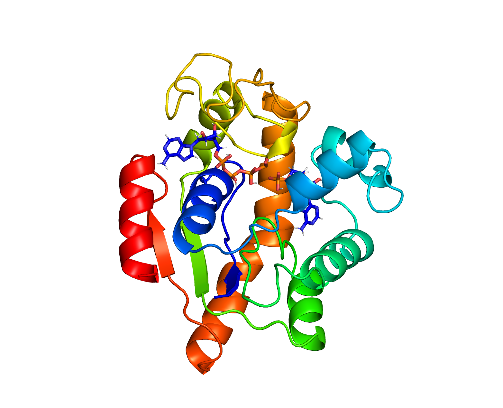

# PyMOLチュートリアル



このチュートリアルを独習したい場合は、[2023年度のセミナー動画(研究室内限定の公開)](https://suitc.sharepoint.com/:v:/r/sites/GR_matsunagalab/Shared%20Documents/General/Recordings/%E3%82%B3%E3%83%B3%E3%83%94%E3%83%A5%E3%83%BC%E3%82%BF%E6%BC%94%E7%BF%923-20230705_151122-Meeting%20Recording.mp4?csf=1&web=1&e=GdI2o7)や[2024年度のセミナー動画(研究室内限定の公開)](https://suitc-my.sharepoint.com/:v:/r/personal/ymatsunaga_mail_saitama-u_ac_jp/Documents/lab/%E5%8B%95%E7%94%BB/20240717_pymol.mp4?csf=1&web=1&nav=eyJyZWZlcnJhbEluZm8iOnsicmVmZXJyYWxBcHAiOiJPbmVEcml2ZUZvckJ1c2luZXNzIiwicmVmZXJyYWxBcHBQbGF0Zm9ybSI6IldlYiIsInJlZmVycmFsTW9kZSI6InZpZXciLCJyZWZlcnJhbFZpZXciOiJNeUZpbGVzTGlua0NvcHkifX0&e=7eokmh)を視聴して学習してください。

#### PyMOLとは？

- 20年くらいの歴史がある分子構造可視化ソフト

- 分子可視化ソフトにはVMDやCHIMERAなどがあるが、表示の美しさ・センスの良さで定評がある

- Python、OpenGL、FreeGLUTなどを使用している

- Warren DeLano個人によって開発されていたが、彼が突然亡くなってしまったため現在はSchrödinger社(バイオ系のソフトウェア会社)によって引き受けられている

- オープンソース版と有料ライセンス(バイナリとプラスαの機能配布)がある

#### Protein Data Bank (PDB)

- https://www.rcsb.org
- 構造データベース
- ファイルフォーマットの説明

#### インストール

オープンソース版をインストールします。現状、MacOSにはHomebrew経由でいれるのがよいです。HomebrewはAnacondaと相性が悪いので、Anacondaはアンインストールするか、pyenvで環境をわけるのが推奨です。

HomebrewでPyMOLをインストールするには @Ag_smithさん 謹製のHomebrewレシピを使わせてもらいます https://qiita.com/Ag_smith/items/58e917710c4eddab46ee
```bash
$ brew install pymol
```

#### 基本操作

- 起動オプション
- ウィンドウ・メニューの説明
- fetchコマンド
    - `fetch PDB-ID`でPDBから構造データをダウンロードして構造を表示します
- マウス操作
    - 左ドラッグで回転
    - 右ドラッグで拡大・縮小
    - Optionを押しながら左ドラッグで並進
    - スクロールでslab
- Objectメニュー
    - Action, Show, Hide, Label, Color
- seqenceメニュー
    - 配列の部分(selection)を選択するのに便利

#### コマンドの文法

PyMOLのコマンドは以下のような文法になっています。
```bash
何かの処理 オブジェクト
```
例えば
```bash
center all
```
というコマンドは、全てのオブジェクト(all)を真ん中へ移動させる(center)という処理を行います。

オブジェクトは、構造データ(PDBファイルなど)を読み込んだり、読み込んだ構造を選択(selection)することで作ることができます。

#### コマンドの実践

実際にコマンドを実行しながら、処理やselectionのやり方を見ていきましょう

```python
# PDBから PDB ID=1ake の chain=Aの構造をダウンロードする
fetch 1akeA

# 全てのオブジェクトを真ん中へ移動させる(allの省略も可)
center all

# 全てのオブジェクトのline表示を追加する
show lines, all

# 特定のオブジェクト(1akeA)をline表示だけにする
as lines, 1akeA

# chain Aの色を赤にする
color red, chain A

# 元素名sのsphere表示を追加する
show spheres, elem s

# 原子名cまたはnまたはoまたはcaのstick表示を追加する
show sticks, name c+n+o+ca

# アミノ酸残基番号10〜15の色を青にする
color blue, resid 7:13

# アミノ酸残基名pro(proline)の色を黄色にする
color yellow, resn pro

# 分子種をselectして表示を変える
as cartoon, polymer
as spheres, solvent
as sticks, organic

# 二次構造をselectしての色を変える
as cartoon
color purple, ss h #ヘリックス
color yellow, ss s #シート
color red, ss l #ループ
color blue, ss “” #それ以外

# logical operatorを使って複雑なselectionを行う
show dots, not name c+n+o+ca #側鎖
color white, resn ala and resid 1:30 and chain A

# selectionを名前を付けてオブジェクトとして保存し、後で使う
select backbone, name c+n+o+ca
show sticks, backbone

# 距離でselectする
as cartoon
show sticks, organic
show sticks, organic around 5.0
show sphere, organic around 5.0 and solvent
```

#### 他のよく使うコマンド

構造の取得、ファイルの読み込み
```bash
#PDB-IDを指定してPDBから構造データをとってくる
fetch 1ake
#更に、Chain=Aを指定する
fetch 1akeA
#構造ファイルを読み込む
load 1ake.pdb
```

Pymol session(pseファイル)の保存と読み込み
```bash
save 1ake.pse
load 1ake.pse
```

画像ファイルとして保存
```bash
# レイトレーシングして綺麗にしてから
ray
# pngへ保存
png 1ake.png
```

PyMOLの初期化
```bash
reinitialize
```

表示の変更
```bash
showは表示を加える
asはその表示だけにする
hideは表示を隠す
```

背景色を変える
```bash
bg_color white
```

構造のセンタリング、方向調整、拡大
```bash
center, orient, zoom
```

構造の重ね合わせ
```bash
align mobile, target
super mobile, target
```

ヘルプ
```bash
help コマンド名
```

#### Scene(シーン)
Sceneとは構造の表示や見ている角度を含んだ現在の可視化状態のことを言います。PyMOLではこのSceneを何個も保存して、後で気軽に呼び出すことができます。

Sceneの保存
```bash
scene new, store
# またはメニューから保存
# またはFn+Cmd+→ on Mac

```

Sceneの呼び出し
```bash
# 左下のSceneボタンをクリック
```

#### PyMOLのワークフロー

1. 構造をとってくる
    - `fetch 1akeA`
1. 見やすい角度や表現でsceneを保存する
    - `scene 001, store`
    - またはアップデートの時は、`scene 001, update`
1. PyMOL session(pse)として保存する
    - `save myfile.pse`
1. 次回作業する時はpseを開き、2へ戻る
    - `load myfile.pse` または起動時に `$ pymol myfile.pse`

#### 輪講で勉強したことの確認をする

それでは輪講で勉強したタンパク質の構造の特徴を実際に確認してみましょう。
確認したらその都度sceneとして保存していきましょう。最後にpseとして保存しましょう。

初期化して構造をとってくる
```bash
reinitialize
fetch 1akeA
```

二次構造と水素結合
```bash
# 二次構造判定
as cartoon
dss #本当はdsspかstrideで二次構造判定することを推奨
# 主鎖の水素結合を表示
as sticks, name c+n+o+ca
Objectメニュー 1akeA -> Action -> find -> polar contacts -> just intra-main chain
```

疎水性
```bash
# 疎水性残基を黄色で表示。内部に埋もれていることを確認する
select hydrophobic, resn ala+cys+gly+val+ile+leu+phe+pro+met+trp+tyr
show spheres, hydrophobic
color yellow, hydrophobic
```

親水性
```bash
# 親水性残基を黄色で表示。表面に露出していることを確認する
select hydrophilic, resn arg+asn+asp+gln+glu+his+lys+ser+thr
show spheres, hydrophilic
color blue, hydrophilic
```

分子表面
```bash
as surf
```

Solvent accessible surface area (SASA)
```bash
# PyMOLではSASAの値だけ
Objectメニュー -> 1akeA -> compute -> surface area -> solvent accessible
```

静電ポテンシャル
```bash
Objectメニュー -> 1akeA -> action -> generate -> vacuum electrostatics -> protein contact potential (local)
```

重ね合わせて構造比較
```bash
reinitialize
fetch 1akeA
fetch 4akeA
align 4akeA, 1akeA
```

結合ポケット(空洞、cavity)
```bash
# 簡易的であるがPyMOLのcavityモードを使う
# タミフルでの例
reinitialize
fetch 2ht7
show surf
set surface_cavity_mode, 1
set surface_color, gray
```

#### 課題1

膜タンパク質の一つで分子を輸送するトランスポータというタンパク質の種類があります。PDB ID = 4dx5 は多剤排出トランスポータAcrBというタンパク質で、薬剤などを輸送します。

- 4dx5は3つのChainから成っています。どれも似た構造なので、Chain Bだけを表示させてみましょう。

- 4dx5を `fetch` してPyMOLで可視化させてみましょう。疎水性アミノ残基を色分けして表示させてみて、疎水アミノ残基がどの領域に集まっているか確認しましょう。

- 4dx5には、薬剤である minocycline (PDBの中での残基名は `MIY`)が結合しています。それを `sphere` で表示させて確認してみましょう。minocyclineが結合している場所は確かにポケットがあるかPyMOLで確認してみましょう。

- minocyclineの周りのアミノ酸残基は疎水性でしょうか？親水性でしょうか？


#### PyMOL実践1: リガンドとタンパク質の相互作用の可視化

Adenylate kinase の 1ake 構造は、リガンド(Ap5A、PDBの中での残基名は `AP5`)が結合しています。リガンドがどの原子との相互作用によって結合しているのか確認してみましょう。

```bash
fetch 1akeA
zoom
hide everything
select ligand, resn AP5
as sticks, ligand
as sticks, ligand around 5.0
Objectメニュー -> ligand -> Action -> find -> polar contacts -> to other atom in object
zoom ligand
```

更に、わかりやすいように周りの原子名を文字で表示(ラベル)させてみましょう
```bash

```

#### PyMOL実践2: シミュレーショントラジェクトリの観察
シミュレーションデータには、DCDやNetCDFというフォーマットがあります。
これのフォーマットは主に原子のXYZ座標のみを保存するためのもので、
原子名やアミノ酸残基名は含まれていません。
したがって、PDBなどの原子名を含むファイルと一緒に読み込んでやる必要があります。

トラジェクトデータは `data/ak.pdb` `data/ak.dcd` からダウンロードしてください。このシミュレーションデータは、Adenylate kinase (PDB ID: 1ake)の1akeの構造から分子動力学シミュレーションを行って得られたものです。

例えば、PDBとDCDファイルを読み込む場合、以下のようにします
```bash
# 最初にPDBファイルをオブジェクト名 obj として読み込む
load ak.pdb, obj, 0, pdb 
# load_trajというコマンドを用いて、DCDデータを obj へ追加する
load_traj ak.dcd, obj, 0, dcd
```

ちょっとコマンドが長くなってしまうので、シェルの起動コマンドラインの引数 `-d` でPyMOLコマンドを起動時に実行してしまって、
それをシェルのコマンド履歴に覚えさせてしまうのが便利です。
```bash
$ pymol -d "load ak.pdb, obj, 0, pdb; load_traj ak.dcd, obj, 0, dcd"
```

まず、水やイオンが大量に入っていることが確認できると思います。PyMOLの右下にある「再生」ボタンを押して動くを確認してください。PyMOLでは異なるフレームの構造を state として保存しています。

水やイオンが確認できた後で、タンパク質構造に集中するために水とイオンを削除します。以下のコマンドを使います。
```bash
remove solvent or inorganic
```

タンパク質に結合しているリガンド(Ap5A)をstickで表示させます
```bash
show sticks, organic
```

シミュレーションデータの構造には水素原子が含まれているのが確認できます。水素原子は構造を見るのに邪魔(といってもプロトンが重要であることはよくありますが)なので、水素原子も消します
```bash
# h. は水素原子を選択するの略語
remove h.
```

シミュレーション結果は分子の並進・回転が入っているで重ね合わせをして取り除きます。2つの異なるオブジェクト同士では `align` や `super` といったコマンドを用いましたが、同じオブジェクト内の異なるフレーム(state)の構造を重ね合わせるには `intra_fit` というコマンドを使います。
```bash
# polymerでタンパク質だけを指定して重ね合わせ
intra_fit polymer
```

#### 課題2

重ね合わせができたら、これまで実験構造を観察するために学んだ様々な表示を行ってみましょう。例えば、リガンド(Ap5A)と相互作用しているアミノ酸残基を stick表示するのは以下のコマンドです。

```bash
select ligand, resn AP5
select active, byres all within 3.5 of ligand
show sticks, active
```

- リガンド(Ap5A)と相互作用している原子を表示させて、それが時間(state)とともにどのように変化していくか観察してください。

- リガンド(Ap5A)との相互作用の変化が、タンパク質全体の構造とどのように関連しているでしょうか？観察してみましょう。

#### PyMOL実践3: フォールディングトラジェクトリの観察
Villin headpiece (PDB ID 1yrf)のフォールディングシミュレーションデータを観察します。

トラジェクトデータは `data/villin.pdb` `data/villin.dcd` からダウンロードしてください。これは分子動力学シミュレーションから得られたトラジェクト理で、フォールディングとアンフォールディングを何回か繰り返しています。

以下のコマンドでデータを読み込みましょう。オブジェクト名で`1yrf`が天然構造、`md`がトラジェクトリとなります。
```bash
$ pymol -d "load 1yrf.pdb; load 1yrf.pdb, md, 0, pdb; load_traj 1yrf.dcd, md, 0, dcd"
```

天然構造へ重ね合わせをしましょう
```bash
align md, 1yrf
```

さらにトラジェクトリの異なる時間(フレーム, state)を重ね合わせます
```bash
intra_fit polymer
```

- TODO: 天然構造での相互作用の確認
- TODO: トラジェクトりの観察
- TODO: 動画の作り方


#### 参考
- [PyMOL Wiki](https://pymolwiki.org)
- [阪大 蛋白研 鈴木守先生のページ](http://www.protein.osaka-u.ac.jp/rcsfp/supracryst/suzuki/jpxtal/Katsutani/install.php)
- [東大 森脇さんのPyMOL tutorial](https://yoshitakamo.github.io/pymol-book/index.html)
- [Molecular Memory: PyMOL Tutorials](https://www.youtube.com/watch?v=mBlMI82JRfI&list=PLUMhYZpMLtal_Z7to3by2ATHP-cI4ma5X)

