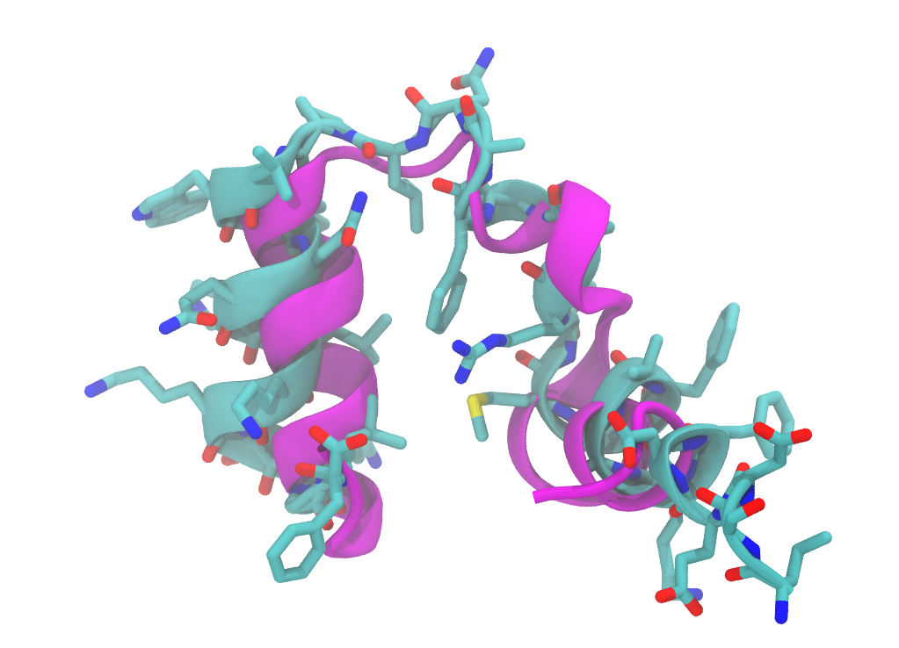

# VMDチュートリアル



## 目次
1. [はじめに](#はじめに)
2. [VMDのインストール](#VMDのインストール)
3. [VMDの起動](#VMDの起動)
4. [分子の読み込み](#分子の読み込み)
5. [表示スタイルの変更](#表示スタイルの変更)
6. [表示の回転・拡大縮小](#表示の回転拡大縮小)
7. [Atom selection](#atom-selection)
8. [表示の保存](#表示の保存)
9. [アニメーションの作成](#アニメーションの作成)
10. [終わりに](#終わりに)

## はじめに

VMD (Visual Molecular Dynamics)は、分子動力学シミュレーションの可視化と解析のための強力なソフトウェアツールである。1992年にイリノイ大学アーバナ・シャンペーン校の Klaus Schulten 研究室で開発が始まり、1995年に最初の公開版がリリースされた。VMDの開発は、分子動力学シミュレーションの結果を効果的に可視化し解析する必要性から生まれた。当時、計算機の性能向上により大規模な分子動力学シミュレーションが可能になりつつあったが、その膨大なデータを適切に扱うツールが不足していた。VMDは、この課題に対応するために設計された。

当初は比較的単純な分子の静的構造の表示から始まったが、その後急速に機能が拡張された。動的なトラジェクトリの表示、高度な解析ツール、スクリプト言語によるカスタマイズ機能などが次々と追加された。何よりもPyMOLに比べて動作が軽いことが利点であり、PyMOLでは動作が遅い分子動力学シミュレーションのデータの可視化において不可欠なツールとなっている。

## VMDのインストール

1. VMDの公式ウェブサイト(https://www.ks.uiuc.edu/Research/vmd/)にアクセスする。
2. 使用するOSに合わせたインストーラをダウンロードする。
3. ダウンロードしたインストーラを実行し、画面の指示に従ってインストールを完了する。

Macの場合、以下の追加手順を実行することでコマンドラインからVMDを簡単に起動できるようになる：

4. ターミナルを開く。
5. `.bashrc`または`.zshrc`ファイル（使用しているシェルに応じて）を編集する。
6. 以下の行を追加する：

```shell
alias vmd="/Applications/VMD\ 1.9.4.app/Contents/MacOS/startup.command"
```

7. ファイルを保存し、ターミナルを再起動するか、`source ~/.bashrc`（または`source ~/.zshrc`）を実行して変更を反映させる。

この設定により、ターミナルで`vmd`と入力するだけでVMDを起動できるようになる。

## VMDの起動

1. デスクトップのショートカットまたはスタートメニューからVMDを起動する。
   LinuxやMacの場合は、ターミナルで`vmd`と入力して起動することもできる。
2. VMDのメインウィンドウと3D表示ウィンドウが開く。

コマンドラインからVMDを起動する際、特定のファイルを直接開くこともできる。以下に例を示す：

- PDBファイルを開く場合:
  ```
  vmd -pdb test.pdb
  ```

- PSFファイルとDCDファイルを同時に開く場合:
  ```
  vmd -psf test.psf -dcd test.dcd
  ```

これらのコマンドを使用することで、VMDの起動と同時に目的の分子構造やトラジェクトリを読み込むことができる。

## 分子の読み込み

1. メインメニューから「File」→「New Molecule」を選択する。
2. 「Filename」欄に分子構造ファイル（PDBファイルなど）のパスを入力するか、「Browse」ボタンでファイルを選択する。
3. 「Load」ボタンをクリックして分子を読み込む。

## 表示スタイルの変更

VMDでは、分子の表示スタイルを変更することで、異なる視点から分子構造を観察できる。以下に基本的な操作手順と、よく使用される表示スタイルの例を示す。

1. メインウィンドウの「Graphics」→「Representations」を選択する。
2. 「Drawing Method」ドロップダウンメニューから表示スタイルを選択する。
3. 「Coloring Method」で原子や残基の色分け方法を選択できる。

### よく使用される表示スタイルの例

#### 1. New Cartoons

タンパク質の二次構造を視覚化するのに適している。

1. 「Selected Atoms」に `protein` と入力する。
2. 「Drawing Method」から「NewCartoons」を選択する。
3. 「Coloring Method」で「Structure」を選択すると、α-へリックス、β-シート、ループ領域が異なる色で表示される。

#### 2. Licorice

個々の原子と結合を詳細に観察するのに適している。

1. 「Selected Atoms」に `all` と入力する。
2. 「Drawing Method」から「Licorice」を選択する。

水素原子を表示から除外したい場合：

3. 「Selected Atoms」を `noh` (not hydrogen の略) に変更する。
4. 「Apply」をクリックして変更を適用する。

これにより、水素以外の全ての原子が棒状で表示される。

### 複数の表示スタイルの組み合わせ

異なる表示スタイルを組み合わせることで、より情報量の多い可視化が可能である。

例：タンパク質の全体構造と特定の残基の詳細を同時に表示

1. 最初に New Cartoons で全体構造を表示する。
2. 「Create Rep」ボタンをクリックして新しい表示を追加する。
3. 新しい表示で、「Selected Atoms」に `resid 50 to 60` （例：残基番号50から60）と入力する。
4. 「Drawing Method」で「Licorice」を選択する。

この設定により、タンパク質全体が cartoon 表示される中で、特定の残基（この場合は50番から60番）が licorice 表示され、詳細な構造を観察できる。

表示スタイルを適切に選択・組み合わせることで、分子構造の理解や特定の構造特徴の観察が容易になる。目的に応じて様々な表示方法を試してみることが重要である。

## 表示の回転・拡大縮小

VMDでは、マウス操作とキーボードショートカットを組み合わせることで、分子の表示を効率的に操作できる。

### マウス操作

- マウスの左ボタンドラッグで分子を回転させる。
- マウスの右ボタンドラッグで拡大・縮小する。
- マウスの中央ボタン（ホイール）ドラッグで表示を平行移動する。

### キーボードショートカット

- 「R」キー：Rotation mode（回転モード）に切り替える。
  - このモードでは、マウスの左ボタンドラッグで分子を自由に回転させられる。
- 「T」キー：Translation mode（平行移動モード）に切り替える。
  - このモードでは、マウスの左ボタンドラッグで分子を画面内で移動させられる。

これらのキーボードショートカットを使用することで、マウスの左ボタンだけで回転と平行移動を切り替えられる。これは特に、複雑な分子構造を詳細に観察する際や、特定の部位に焦点を当てて作業する場合に便利である。

また、「S」キーを押すと、現在の表示をスケーリング（拡大・縮小）モードに切り替えることができる。このモードでは、マウスの左ボタンドラッグで表示全体を拡大・縮小できる。

これらのモードを適切に使い分けることで、分子の観察や解析をより効率的に行うことができる。

## Atom selection

VMDの強力な機能の一つが柔軟なAtom selectionです。ここでは、Adenylate kinase (AdK)のholo構造を例に、様々なAtom selectionの方法を説明します。

使用するファイル：
- adk.pdb (構造ファイル)
- adk.psf (トポロジーファイル)
- adk.dcd (トラジェクトリファイル)

### 基本的なAtom selection

1. 「Graphics」→「Representations」を開く。
2. 「Selected Atoms」フィールドに選択文を入力する。
3. 「Apply」をクリックして選択を反映させる。

### Atom selectionの例

1. タンパク質全体の選択：
   ```
   protein
   ```

2. 主鎖原子の選択：
   ```
   backbone
   ```

3. 側鎖原子の選択：
   ```
   sidechain
   ```

4. 特定の残基番号の選択（例：残基10から30）：
   ```
   resid 10 to 30
   ```

5. 特定のアミノ酸の選択（例：全てのリジン）：
   ```
   resname LYS
   ```

6. 特定の原子名の選択（例：全てのα炭素）：
   ```
   name CA
   ```

7. 水素原子を除外した選択：
   ```
   noh
   ```

8. リガンド（AP5）の選択：
   ```
   resname AP5
   ```

9. タンパク質とリガンドの選択：
   ```
   protein or resname AP5
   ```

10. タンパク質の特定のドメインの選択（例：AdKのLID domain、残基112-167）：
    ```
    protein and resid 112 to 167
    ```

11. リガンドから5Å以内のタンパク質残基の選択：
    ```
    protein and same residue as within 5 of resname AP5
    ```

12. 特定の元素の選択（例：全ての炭素原子）：
    ```
    element C
    ```

13. 二次構造に基づく選択（例：全てのα-へリックス）：
    ```
    helix
    ```

14. 複合的な選択（例：LIDドメイン内の極性残基）：
    ```
    (resid 112 to 167) and (resname SER or resname THR or resname ASN or resname GLN or resname TYR or resname LYS or resname ARG or resname HIS or resname ASP or resname GLU)
    ```

### Atom selectionの応用

1. 動的な挙動の観察：
   LIDドメインとCORE domain（残基1-29, 60-121, 160-214）の動きを比較する。
   ```
   (resid 112 to 167) or (resid 1 to 29 or resid 60 to 121 or resid 160 to 214)
   ```
   この選択を使用して、RMSDの計算やアニメーションの作成を行うことで、AdKの開閉運動を観察できる。

2. 活性部位の可視化：
   AP5リガンドと相互作用する残基を可視化する。
   ```
   (resname AP5) or (protein and same residue as within 3 of resname AP5)
   ```
   この選択を使用して、リガンド結合部位の詳細な構造や相互作用を観察できる。

これらのAtom selectionを適切に組み合わせることで、AdKの構造や機能に関する様々な情報を視覚化し、解析することができます。目的に応じて選択文を工夫し、効果的な可視化と解析を行うことが重要です。

## 表示の保存

VMDでは、現在の表示を画像として保存するだけでなく、現在の状態（state）を保存し、後で再現することも可能である。

### 画像として保存

1. メインメニューから「File」→「Render」を選択する。
2. 解像度やファイル形式を設定し、「Start Rendering」をクリックする。

### 状態### 状態（State）の保存と読み込み

VMDの現在の状態（分子の読み込み状態、表示スタイル、視点など）を保存し、後で再現することができる。

#### 状態の保存

1. VMDのコンソールウィンドウを開く（メインメニューの「Extensions」→「Tk Console」）。
2. 以下のコマンドを入力して実行する：

   ```
   save_state test.vmd
   ```

   これにより、現在の状態が`test.vmd`ファイルに保存される。

#### stateファイルの性質

重要な点として、保存されるstateファイル（この場合`test.vmd`）には分子構造データそのものは含まれない。このファイルには、現在の状態を再現するためのTcl（Tool Command Language）コマンドのシーケンスのみが含まれている。

具体的には以下のような情報がTclコマンドとして保存される：

- 分子ファイルの読み込みコマンド
- 表示スタイルの設定
- カメラの位置や向き
- 選択されている原子や表示オプション

このため、stateファイルを使用して状態を再現する際は、元の分子構造ファイル（PDBやPSFなど）が必要となる。stateファイルは、これらの元ファイルをどのように読み込み、表示するかの「レシピ」のようなものである。

#### 状態の読み込み

保存した状態を読み込むには、以下のいずれかの方法を使用する：

1. VMDの起動時にコマンドラインから読み込む：

   ```
   vmd -e test.vmd
   ```

2. 既に起動しているVMDで読み込む場合は、Tk Consoleで以下のコマンドを実行する：

   ```
   play test.vmd
   ```

これらの機能を使用することで、複雑な表示設定や解析設定を保存し、後で簡単に再現することができる。研究やプレゼンテーションの準備において非常に有用である。

## アニメーションの作成

分子動力学シミュレーションの結果を可視化するには、トラジェクトリデータを読み込み、アニメーションを作成する必要がある。ここでは、トラジェクトリの読み込みから分子のフィッティングまでの手順を説明する。

### トラジェクトリの読み込み

1. コマンドラインから直接トラジェクトリを読み込むには、以下のコマンドを使用する：

   ```
   vmd -psf test.psf -dcd test.dcd
   ```

   ここで、`test.psf`はタンパク質構造ファイル、`test.dcd`は動力学トラジェクトリファイルである。

2. すでにVMDが起動している場合は、メインメニューから「File」→「New Molecule」を選択し、PFSファイルを読み込んだ後、同じ分子に対してDCDファイルを読み込む。

### アニメーションの再生

1. トラジェクトリが読み込まれると、VMDのメインウィンドウ下部にアニメーションコントロールが表示される。
2. 再生ボタン（右向きの三角形）をクリックしてアニメーションを開始する。
3. スライダーを使用して、特定のフレームに移動することもできる。

### 分子のフィッティング

分子の全体的な動きを取り除き、内部の構造変化に注目するために、フィッティングを行うことができる。

1. メインメニューから「Extensions」→「Analysis」→「RMSD Trajectory Tool」を選択する。
2. 「RMSD Trajectory Tool」ウィンドウが開く。
3. 「Atom selection」フィールドに、フィッティングに使用する原子の選択文を入力する。
   例：`protein and name CA`（タンパク質のα炭素原子のみを選択）
4. 「RMSD」ボタンをクリックする。

これにより、選択した原子群に基づいてフィッティングが行われ、RMSDの計算とグラフの表示が行われる。

### フィッティング後のアニメーション観察

1. フィッティングが完了すると、分子の全体的な並進・回転運動が除去され、内部の構造変化がより明確に観察できるようになる。
2. アニメーションコントロールを使用して、フィッティングされたトラジェクトリを再生する。
3. 必要に応じて、表示スタイルを変更したり、特定の領域にズームインしたりして、興味のある構造変化を詳細に観察する。

### 注意点

- フィッティングに使用する原子群の選択は重要である。通常、タンパク質の骨格（α炭素など）を使用することが多いが、研究の目的に応じて適切な選択を行う必要がある。
- 大きな構造変化や柔軟な領域がある場合、フィッティングの結果が歪む可能性がある。そのような場合は、安定な領域のみを選択してフィッティングを行うことを検討する。

これらの手順を通じて、分子動力学シミュレーションの結果を視覚的に解析し、重要な構造変化や動的な挙動を観察することができる。アニメーションとフィッティングを組み合わせることで、分子の動きをより深く理解することが可能となる。

## 終わりに

この文章はCaulde 3.5 Sonnet の Artifacts で作成されました。

